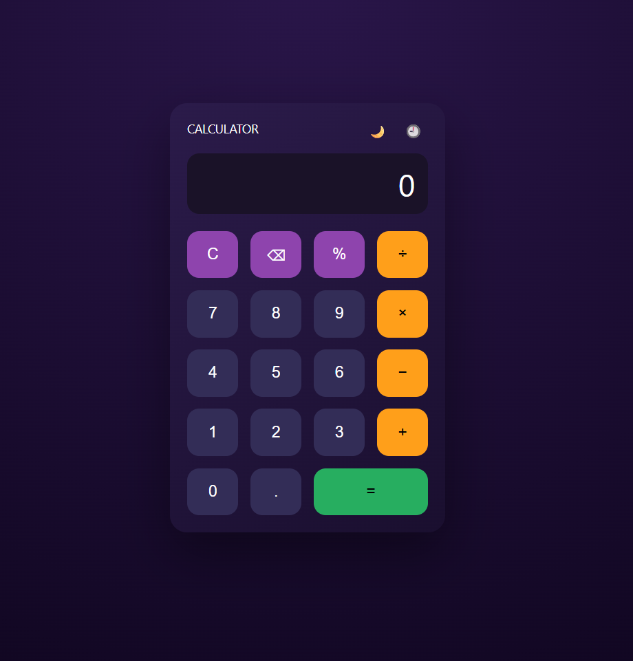

# 🧮 Modern Calculator Web App

A modern, responsive calculator web application built using **HTML, CSS, and JavaScript** with a clean UI inspired by contemporary design trends.

## ✨ Features
- Basic arithmetic operations (+, −, ×, ÷, %)
- Dark and Light mode toggle
- Keyboard input support
- Calculation history panel
- Real-time display updates
- Responsive and user-friendly interface

## 🛠️ Technologies Used
- HTML5
- CSS3 (Flexbox, Grid, CSS Variables)
- JavaScript (DOM Manipulation, Keyboard Events)

## 📸 Output

